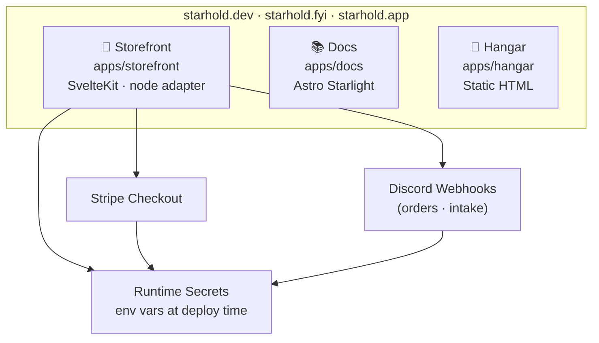

<div align="center">

# starhold-site

**Public web properties for Starhold Software — storefront, docs, and app launcher.**

[](https://github.com/Quadstronaut/Starhold/commits/master)
[](https://github.com/Quadstronaut/Starhold)
[](https://github.com/Quadstronaut/Starhold)
[](https://kit.svelte.dev)
[](https://astro.build)
[](https://stripe.com)
[](https://www.typescriptlang.org)

---

[](#-storefront)
[](#-docs)
[](#-hangar)
[](#-develop)
[](#-build)
[](#-notes)

</div>

---

## 🗺️ At a Glance

<a id="at-a-glance"></a>

| Path | Stack | Serves | Domains |
|------|-------|--------|---------|
| `apps/storefront` | SvelteKit (node adapter) | Store — catalog, configurator, cart, Stripe Checkout | `starhold.dev` / `.fyi` / `.app` |
| `apps/docs` | Astro Starlight | Documentation & knowledge site | `starhold.dev` / `.fyi` / `.app` |
| `apps/hangar` | Static HTML | Hosted-apps launcher | `starhold.dev` / `.fyi` / `.app` |

> Each app is self-contained — install and build from its own directory.

---

## 🏗️ Architecture

<a id="architecture"></a>



---

## 🛒 Storefront

<a id="storefront"></a>

**`apps/storefront`** — SvelteKit (node adapter)

The store: product catalog, bot configurator, shopping cart, and Stripe Checkout integration. Discord webhooks notify on orders and intake submissions.

---

## 📚 Docs

<a id="docs"></a>

**`apps/docs`** — Astro Starlight

The documentation and knowledge site.

---

## 🚀 Hangar

<a id="hangar"></a>

**`apps/hangar`** — Static HTML

The hosted-apps launcher.

---

## 💻 Develop

<a id="develop"></a>

```sh
cd apps/storefront   # or apps/docs
npm install
npm run dev
```

---

## 🔨 Build

<a id="build"></a>

```sh
# SvelteKit → node server in build/
cd apps/storefront
npm run build
```

```sh
# Astro static site → dist/
cd apps/docs
npm run build
```

---

## 📋 Notes

<a id="notes"></a>

> [!IMPORTANT]
> Runtime secrets are supplied via environment variables at deploy time — **never committed.**

Required environment variables:

| Variable | Purpose |
|----------|---------|
| `STRIPE_SECRET_KEY` | Stripe API authentication |
| `STRIPE_PRICE_CUSTOM_BOT` | Custom bot product price ID |
| `STRIPE_WEBHOOK_SECRET` | Stripe webhook signature verification |
| `DISCORD_WEBHOOK_ORDERS` | Order notification webhook |
| `DISCORD_WEBHOOK_INTAKE` | Intake form submission webhook |

> [!NOTE]
> `.env.example` files are not yet present. The variables above are the full required set.

> [!NOTE]
> This repository holds the public site code only.
