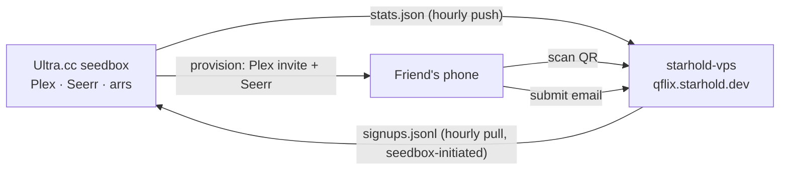

# QFlix Invite — Design

**Date:** 2026-07-28
**Status:** Approved for planning
**Repos touched:** `starhold-site` (page), `QFlix` (stats producer, provisioner)

---

## 1. Purpose

A short, unlisted recruiting page at `qflix.starhold.dev` that converts a friend
scanning a QR code — standing at a skating rink, one-handed, distracted — into a
signed-up QFlix member.

Not a public product page. Not the dashboard. Advertising only.

**Success:** a friend scans, reads under 350 words, submits the email they want on
Plex, and the operator provisions them with one command.

---

## 2. Constraints

| Constraint | Source | Consequence |
|---|---|---|
| Page must convert in a distracted, standing, one-handed context | Skating-rink launch | Single field, above fold, zero scroll to convert |
| `starhold.dev` is public and abusable | Operator | No Plex admin token, no Seerr key, no secrets on that box |
| No autopay yet; Zelle handled by DM | Operator | Payment details never appear on the page |
| $50/mo flat, standard rate, non-negotiable in public | Operator | No tiers, no "starting at", no per-day math |
| Numbers must never be inflated | Operator | Member count is operator-typed, not derived |
| Starhold visual theme must NOT carry over | Operator | Separate app with its own styling |
| SvelteKit retained | Operator | Matches `apps/storefront` stack |

---

## 3. System shape



**The seedbox always initiates.** The public VPS never reaches into QFlix infra and
never holds a credential that could invite a Plex user. One cron script performs
both directions in a single SSH round-trip.

### Components

| Component | Repo | Responsibility |
|---|---|---|
| `apps/qflix-invite` | starhold-site | The page. SvelteKit 5, node adapter, own theme, own Dockerfile. Mirrors `apps/storefront` structure. |
| `scripts/maint/qflix-stats.py` | QFlix | Emits `stats.json`; rsyncs to VPS; pulls `signups.jsonl` back. |
| `scripts/maint/qflix-provision.py` | QFlix | `--email` → Plex library invite + Seerr import. Used manually from day one. |

Each is independently testable. The page renders whatever `stats.json` contains and
degrades to last-known values if the file is stale. The provisioner is a pure CLI
with no dependency on the page existing.

---

## 4. Persuasion architecture

Every element below is anchored to a specific finding. Elements without an anchor
were cut.

| Element | Principle | Source |
|---|---|---|
| Tier 1 shown achieved, **with a stated reason** | Endowed progress — head start raised goal completion 34% vs 19%; effect disappears without a reason for the head start | Nunes & Drèze 2006, *J. Consumer Research* 32(4) |
| Ladder rendered as a progress bar with the next rung named and close | Goal gradient — effort accelerates near a reward, responding to perceived rather than actual proximity | Kivetz, Urminsky & Zheng 2006, *JMR* 43(1) |
| First-person plural; named beta testers; "circle" not "customers" | Unity — shared identity, Cialdini's 7th principle | Cialdini, *Pre-Suasion* 2016 |
| Operator section shows specific live work (canary count from `apps.yaml`, audit cadence) | Labor illusion — operational transparency raises perceived value, mediated by reciprocity | Buell & Norton 2011, *Management Science* 57(9) |
| One field, above fold, no scroll required to convert | B=MAP — motivation, ability and prompt must coincide; ability is floored in the launch context | Fogg Behavior Model |
| ~350 word budget; single dominant CTA; sub-2s load | Mobile converts ~2.5–2.9% vs desktop 4.8–5.1% | 2026 CRO consensus |
| Explicit promise printed beside the QR, not a bare code | Print scan rates 3–8%; CTA adjacency lifts scan rate; in-person beats passive placement | 2026 QR benchmarks |
| Demo library as a small prior ask | Foot-in-the-door — 76% vs <20% compliance after a small prior commitment | Freedman & Fraser 1966 |
| Exactly one honest limitation, stated flat | Two-sided messages raise credibility with skeptics, but disclaimers backfire when the speaker is already credible — and the operator is personally credible to this audience | Meta-analyses; *OBHDP* 2024 |
| No countdowns, no urgency theater, no invented seat cap | Reactance — high-controlling language provokes refusal; autonomy-supportive phrasing defuses it | Reactance meta-analyses, *Human Comm. Research* |
| Every number exact, never rounded to a marketing figure | Specificity outperforms vague claims for credibility | Heath & Heath; CRO literature |

### Deliberately cut

- **Interactive stack calculator.** Six checkboxes is unacceptable ability cost in
  the launch context. Replaced by one static line carrying the same argument.
- **Cost-per-day reframe ($1.64/day).** Reads as salesy to a friend and risks
  reactance. A flat, unapologetic $50 is itself a quality signal.
- **"Deletes your shows" attack on streamers.** QFlix runs a 60-day reaper; the
  attack lands on QFlix too.
- **Bigger-server messaging.** Replaced by the unlock ladder.
- **Seat cap.** Undefined by the operator; an invented cap is a claim that would
  later be broken.

---

## 5. Page content

### 5.1 Screen 1 — above fold, no scroll

> # No ads. No price hikes. No selling your data. Ever.
>
> Not a catalog. A request line. Everything on demand.
>
> `[ the email you want on Plex ]` `[ Claim a seat ]`
>
> $50/month. Flat.

One proof figure sits under the field, pulled live from `stats.json` (title count
across all four libraries).

### 5.2 Screen 2 — proof wall

Live from `stats.json`. Exact figures only:

- Titles across four libraries
- Library size on disk
- Requests fulfilled, all time
- Median request → playable time
- Monitors reporting (`n/n`)
- `Updated 23m ago`

Member count is **not** shown here. See §5.3.

### 5.3 Screen 3 — the ladder

> **Beta seat: filled — the Brintons.**

| # | Unlocks | At | State |
|---|---|---|---|
| 1 | Torrents **+** Usenet — two sources, not one | — | ✅ Achieved before anyone joined |
| 2 | Maximum storage space | 2 | 🔓 One away |
| 3 | Dedicated .com + sideloaded Android app — no app store, no metrics, no tracking. Just a push when your request finishes downloading. | 3 | 🔒 |
| 4 | Longer retention + 4K files | 4 | 🔒 |
| 5 | Bring a mooch — guest account, Plex only, no requests | 5 | 🔒 |

Tier `N` unlocks at `N` paying members. Tier 1 is pre-achieved and **must** display
its reason ("landed before anyone joined") — without a stated reason the endowed
progress effect does not occur.

Footer, flat, no asterisk:

> Support requests are open to everyone from day one. That's not a tier and never
> will be.

Seat count appears **only here**, where 2 reads as momentum rather than emptiness.

### 5.4 Screen 4 — the operator

What justifies $50. Specific, not adjectival:

- Always closing gaps — canary count live from `manifest/apps.yaml`, ticks up on its own
- Audited on schedule and at random
- Self-healing — monitors catch failures, recovery fires, operator is paged
- Improves weekly — same evidence the newsletter already publishes
- Every connection encrypted in transit — the same TLS your bank uses

Wording constraint: **never** "military grade" or "super encrypted". Any
technically literate reader treats those as a tell; understatement persuades the
people most likely to check.

### 5.5 Screen 5 — demo, limitation, FAQ

> **Not sure it'll play on your TV?** Name one title. I'll stand up a private
> library with it in it, invite you, and you can prove it works on your own
> hardware and your own internet before you pay a cent.

Positioned below the primary ask so it does not cannibalise direct signups.

One honest limitation, stated once:

> Occasionally something rare or same-day-new isn't findable yet. I'll tell you
> straight when that happens.

Three FAQs, collapsed by default: which app do I use, what about profiles for my
kids, what if it breaks at 11pm.

### 5.6 Coverage line

Replaces the cut calculator:

> Netflix's catalog is different in Canada. Max drops titles on the 30th. QFlix
> isn't a catalog — you ask, it appears.

---

## 6. `/flip` — the phone-flip QR

Full-bleed, dark, one hook line, large QR, nothing else. Built to be handed across
a table.

- QR generated once and committed as a static SVG. No runtime dependency.
- Explicit promise printed beside the code, per scan-rate research.
- `@media print` styling so the same route prints as a card.

---

## 7. Signup and provisioning

### 7.1 Phase 1 — tonight

Form collects the email the friend wants on Plex. Demo path additionally collects
one title.

On submit:
1. Append to `signups.jsonl` on the VPS.
2. POST to a Discord webhook, reusing the pattern in
   `storefront/src/lib/server/discord.ts`.
3. Render the thank-you state.

Thank-you copy:
> Watch for the Plex invitation email. I'll message you payment details. Your
> dashboard is here → `qflix.quadstronix.dev`

Payment details never appear on the page.

Operator then runs the provisioner by hand. It is not speculative scaffolding — it
is the tool in daily use until Stripe exists.

### 7.2 The provisioner

```
qflix-provision.py --email X                                    # member: 4 libraries + Seerr
qflix-provision.py --email X --libraries "QFlix - Demo - Kyle"  # demo: one bespoke library
qflix-provision.py --email X --guest                            # mooch: Plex only, no Seerr
```

Default library set, from `scripts/maint/qflix-reaper.py:112`:

- `QFlix - Movies`
- `QFlix - Anime Movies`
- `QFlix - TV`
- `QFlix - Anime`

Two flags cover member, demo and guest cases. No speculative code paths.

### 7.3 Phase 2 — this weekend

Stripe Checkout replaces "I'll message you payment details". The provisioner is
unchanged.

### 7.4 Phase 3

Stripe webhook (`checkout.session.completed`) invokes the same provisioner
unattended. The trigger changes; the tool does not.

---

## 8. Stats feed

`qflix-stats.py` runs hourly on the seedbox and emits `stats.json`:

- Title counts per library and total
- Library size on disk
- Requests fulfilled, all time
- Median request → playable duration
- Monitors reporting, as `up/total`
- Canary count, read from `manifest/apps.yaml`
- `generated_at` timestamp

The page renders `generated_at` as "updated Nm ago". If the file is older than six
hours the page shows the timestamp plainly rather than hiding staleness.

**Member count is not in `stats.json`.** It lives in an operator-edited
`src/lib/seats.ts` field in the invite app. Deriving it from Plex shares would
silently count guests, the beta seat and every demo library as members, inflating
the page without the operator noticing. A typed number cannot drift.

---

## 9. Security and hygiene

The VPS is public and abusable, so the form carries:

- Rate limiting, reusing `storefront/src/lib/server/rate-limit.ts`
- A honeypot field
- Email shape validation
- `noindex, nofollow` meta plus a `robots.txt` disallow

**Unlisted, not private.** `qflix.starhold.dev` is guessable. An invite code would
make it genuinely private at the cost of a conversion step on every scan; the
operator has accepted unlisted.

No Plex token, Seerr key, or Zelle handle is ever present on the VPS.

---

## 10. Testing

| Suite | Covers |
|---|---|
| vitest (`apps/qflix-invite`) | Stats parsing and staleness handling, ladder tier computation, email validation, honeypot and rate-limit behaviour |
| pytest (`QFlix/tests/unit/`) | Provisioner argument handling, library resolution, guest mode omitting Seerr, stats emission shape. Pure-Python, no SSH — matches the existing suite. |
| Playwright (`apps/qflix-invite/e2e`) | Above-fold conversion without scrolling, mobile viewport, `/flip` render |

---

## 11. Deployment

- Host: `starhold-vps` (15.204.116.242, tailnet 100.119.120.88)
- Container built from `apps/qflix-invite/Dockerfile`, mirroring the storefront's
  multi-stage node:24-alpine build
- Reverse proxy entry for `qflix.starhold.dev`
- `stats.json` and `signups.jsonl` live on a mounted path the container reads and
  the seedbox rsyncs against

---

## 12. Open item

The operator sets `payingMembers` in `src/lib/seats.ts` before deploy. Current
value: 1 subscriber, plus 1 beta seat shown separately. Everything else ships
independently of this value.
